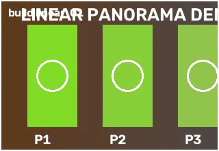
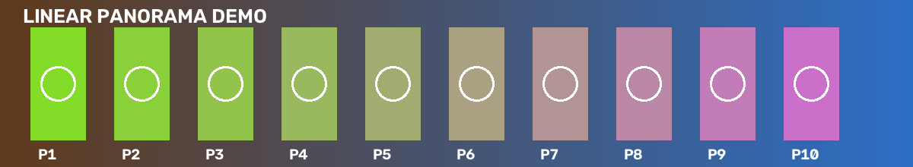
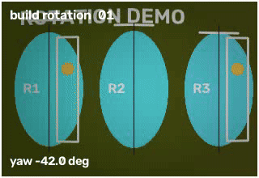
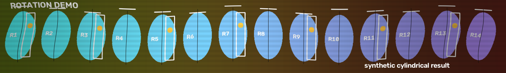
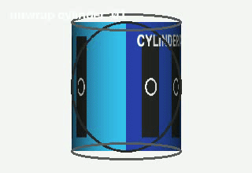

<p align="center">
  
</p>

<h1 align="center">Panoramator</h1>

<p align="center">
Python package for building panoramas from video and unwrapping the observed surface of a rotating object.
</p>

<div align="center">


</div>

<p align="center">
OpenCV powered • Scene panoramas and object unwrap • Python CLI
</p>

## What It Does

`panoramator` covers two related, but different tasks:

| Task | Command | Use when |
| --- | --- | --- |
| Scene panorama | `build` | Camera moves along a scene or rotates in place |
| Observed-surface unwrap | `unwrap` | Camera orbits one object and you want its visible surface as a flat map |

If the goal is a wide scene, use `build`. If the goal is to inspect the outside of one object, use `unwrap`.

## Quick Start

### Install

```bash
pip install panoramator
```

### Build a panorama

```bash
panoramator build video.mp4 output.png
```

### Unwrap an object surface

```bash
panoramator unwrap video.mp4 surface.png --surface auto --allow-partial
```

## Typical Workflows

### 1. Handheld sweep across a scene

```bash
panoramator build input.mp4 output.png
```

### 2. Camera rotates in place

```bash
panoramator build input.mp4 output.png --capture-mode rotation --horizontal-fov-degrees 70
```

### 3. Orbit around one object

```bash
panoramator unwrap input.mp4 surface.png --surface auto --allow-partial
```

### 4. Clean crop for presentation-ready output

```bash
panoramator build input.mp4 output.png --photo-mode --photo-crop-margin-px 5
```

## Examples And Visuals

Temporary demo assets already live in [`docs/public-demo`](docs/public-demo). These animated previews can be replaced later with final real captures:

| Scenario | Input | Result |
| --- | --- | --- |
| Linear scene panorama<br>camera translates across the scene | [](docs/public-demo/build-linear-input.mp4) | [](docs/public-demo/build-linear-reference.png) |
| Rotation panorama<br>camera rotates in place around one viewpoint | [](docs/public-demo/build-rotation-input.mp4) | [](docs/public-demo/build-rotation-reference.png) |
| Object unwrap<br>camera orbits one object to flatten its visible surface | [](docs/public-demo/unwrap-cylinder-input.mp4) | [](docs/public-demo/unwrap-cylinder-reference.png) |

When videos are ready, the README will work best if each scenario shows:

1. a short input clip or GIF;
2. the resulting panorama or surface map;
3. one sentence explaining why this mode was chosen.

## Practical Recipes

### Soft footage

Use adaptive blur filtering before lowering thresholds manually:

```bash
panoramator build input.mp4 output.png --adaptive-blur-threshold
```

If frames are only slightly soft, keep the adaptive threshold and tune rescue sharpening:

```bash
panoramator build input.mp4 output.png \
  --adaptive-blur-threshold \
  --blur-rescue-sharpen-strength 0.25 \
  --blur-rescue-sharpen-sigma 1.0
```

### Faster feature extraction with full-resolution output

```bash
panoramator build input.mp4 output.png --feature-downscale 0.5 --frame-selection-window-size 3
```

### Visible seams

```bash
panoramator build input.mp4 output.png --seam-blur-kernel 7 --seam-band-width 9 --feather-blend-kernel 25
```

### Cleaner unwrap crop

```bash
panoramator unwrap input.mp4 surface.png \
  --surface auto \
  --allow-partial \
  --photo-mode \
  --photo-crop-margin-px 5
```

## Output And Debug Artifacts

Both commands can save a debug directory with the effective config and diagnostics.

For `unwrap`, the `*_debug` directory typically includes:

* `run.json`
* `effective_config.json`
* coverage maps
* source and error maps
* intermediate mosaics

Disable debug output when you only need the final image:

```bash
panoramator build input.mp4 output.png --no-save-debug-artifacts
```

## Current Features

* video input via OpenCV;
* scene panorama building for `linear` and `rotation` capture;
* observed-surface `unwrap` pipeline for orbital object capture;
* ORB or SIFT feature extraction with geometry validation and fallback sampling;
* planar, cylindrical, and spherical projection surfaces with optional camera calibration;
* photometric normalization, seam handling, crop policies, and sharpening;
* debug artifacts and local private acceptance workflows.

## Important Concepts

### Capture mode and projection are different

`--capture-mode` describes how the camera moved:

* `auto`
* `linear`
* `rotation`

`--projection` describes how the result is represented:

* `auto`
* `planar`
* `cylindrical`
* `spherical`

For a camera rotating in place, use `--capture-mode rotation`. For orbit around one object, do not use `build`; use `unwrap`.

### First settings to try

Most users do not need the full parameter list first. In practice, these options matter most:

* `--capture-mode rotation` for in-place camera rotation;
* `--horizontal-fov-degrees` or `--focal-length-px` for curved projection calibration;
* `--adaptive-blur-threshold` for soft footage;
* `--feature-downscale` to reduce feature cost without shrinking final output;
* `--photo-mode` for presentation-friendly crops;
* `--no-save-debug-artifacts` when diagnostics are not needed.

## Using As A Python Package

```python
from pathlib import Path

from panoramator import PanoramaBuilder, PanoramaConfig

config = PanoramaConfig(
    sampling_step=15,
    max_frames=25,
    motion_model="partial_affine",
    crop_result=True,
)

builder = PanoramaBuilder(config)
result = builder.build_from_video(
    video_path=Path("input.mp4"),
    output_path=Path("output.png"),
)

print(result.metadata)
print(result.diagnostics.status)
print(result.diagnostics.output_files)
```

## Installation For Development

```bash
python -m pip install -e ".[dev]"
```

## Tests

```bash
pytest -q
```

Private acceptance fixtures are intentionally separate from the default reproducible suite:

```bash
PANORAMATOR_RUN_PRIVATE_VIDEO=1 python3 -m pytest tests/test_private_orbit_acceptance.py -q
PANORAMATOR_RUN_PRIVATE_VIDEO=1 python3 -m pytest tests/test_private_panorama_acceptance.py -q
```

## Documentation

* Showcase: [`docs/showcase.md`](docs/showcase.md)
* Roadmap: [`docs/roadmap.md`](docs/roadmap.md)
* Russian README: [`README.ru.md`](README.ru.md)

## Full Configuration

The CLI and `PanoramaConfig` expose many tuning parameters for frame sampling, geometry, blending, cropping, sharpening, and diagnostics.

For day-to-day use, start with the recipes above and inspect:

```bash
panoramator build --help
panoramator unwrap --help
```

If needed, parameters can be set through:

* `PanoramaConfig`
* a JSON config file
* CLI flags and targeted overrides
