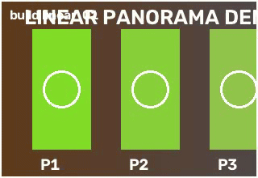
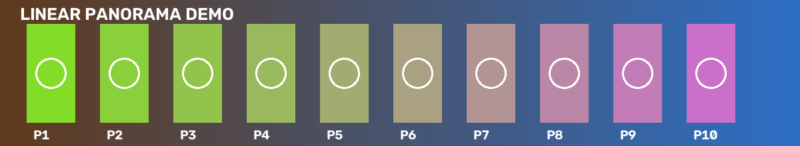
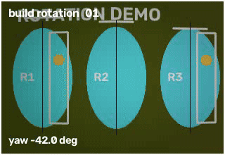
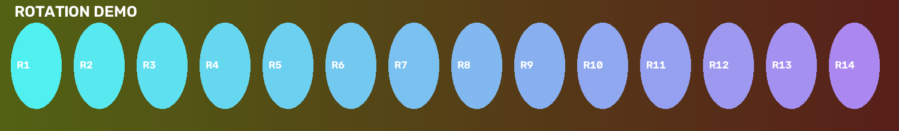
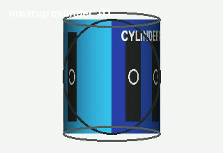
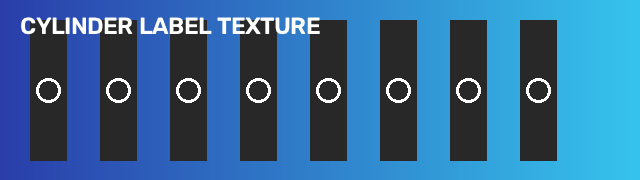

<p align="center">
  
</p>

<h1 align="center">Panoramator</h1>

<p align="center">
Python-пакет для построения панорам из видео и развёртки наблюдаемой поверхности вращающегося объекта.
</p>

<div align="center">


</div>

<p align="center">
На базе OpenCV • Панорамы сцен и развёртка объекта • Python CLI
</p>

## Что Делает Проект

`panoramator` покрывает две близкие, но разные задачи:

| Задача | Команда | Когда использовать |
| --- | --- | --- |
| Панорама сцены | `build` | Камера движется вдоль сцены или поворачивается на месте |
| Развёртка наблюдаемой поверхности | `unwrap` | Камера обходит один объект, и нужна плоская карта его видимой поверхности |

Если нужна широкая панорама сцены, используйте `build`. Если нужно показать внешнюю поверхность одного объекта, используйте `unwrap`.

## Быстрый Старт

### Установка

```bash
pip install panoramator
```

### Построить панораму

```bash
panoramator build video.mp4 output.png
```

### Построить развёртку поверхности объекта

```bash
panoramator unwrap video.mp4 surface.png --surface cylindrical
```

## Типовые Сценарии

### 1. Ручной проход вдоль сцены

```bash
panoramator build input.mp4 output.png
```

### 2. Поворот камеры на месте

```bash
panoramator build input.mp4 output.png --capture-mode rotation --horizontal-fov-degrees 70
```

### 3. Обход одного объекта

```bash
panoramator unwrap input.mp4 surface.png --surface cylindrical
```

### 4. Аккуратная обрезка для презентационного результата

```bash
panoramator build input.mp4 output.png --photo-mode --photo-crop-margin-px 5
```

## Примеры И Визуализация

Временные demo-материалы уже лежат в [`docs/public-demo`](docs/public-demo). Эти анимированные превью позже можно заменить на реальные итоговые записи:

| Сценарий | Вход | Результат |
| --- | --- | --- |
| Линейная панорама сцены<br>камера смещается вдоль сцены | [](docs/public-demo/build-linear-input.mp4) | [](docs/public-demo/build-linear-reference.png) |
| Панорама при повороте на месте<br>камера вращается из одной точки обзора | [](docs/public-demo/build-rotation-input.mp4) | [](docs/public-demo/build-rotation-reference.png) |
| Развёртка объекта<br>камера обходит один объект, чтобы распрямить его видимую поверхность | [](docs/public-demo/unwrap-cylinder-input.mp4) | [](docs/public-demo/unwrap-cylinder-reference.png) |

Когда будут готовы финальные видео, блок в README лучше всего будет смотреться так:

1. короткий входной клип или GIF;
2. итоговая панорама или карта поверхности;
3. одна фраза о том, почему здесь выбран именно этот режим.

Пока `Linear` и `Rotation` показывают временные плейсхолдеры. Их стоит заменить на более контрастные демонстрации, где различие задаётся не объектами, а типом движения камеры и геометрией сцены.

## Практические Рецепты

### Мягкое или слегка размытое видео

Сначала попробуйте адаптивную фильтрацию по резкости, а не ручное ослабление порогов:

```bash
panoramator build input.mp4 output.png --adaptive-blur-threshold
```

Если кадры только немного мягкие, оставьте adaptive threshold и подстройте rescue sharpening:

```bash
panoramator build input.mp4 output.png \
  --adaptive-blur-threshold \
  --blur-rescue-sharpen-strength 0.25 \
  --blur-rescue-sharpen-sigma 1.0
```

### Более дешёвое извлечение признаков без потери итогового разрешения

```bash
panoramator build input.mp4 output.png --feature-downscale 0.5 --frame-selection-window-size 3
```

### Заметные швы

```bash
panoramator build input.mp4 output.png --seam-blur-kernel 7 --seam-band-width 9 --feather-blend-kernel 25
```

### Более аккуратная обрезка развёртки

```bash
panoramator unwrap input.mp4 surface.png \
  --surface cylindrical \
  --photo-mode \
  --photo-crop-margin-px 5
```

## Выходные Данные И Debug-Артефакты

Обе команды могут сохранять debug-директорию с эффективной конфигурацией и диагностикой.

Для `unwrap` директория `*_debug` обычно содержит:

* `run.json`
* `effective_config.json`
* coverage maps
* source и error maps
* промежуточные mosaic-артефакты

Если нужен только итоговый файл, отключите сохранение диагностики:

```bash
panoramator build input.mp4 output.png --no-save-debug-artifacts
```

## Возможности Текущей Версии

* чтение видео через OpenCV;
* построение панорам сцены для `linear` и `rotation`;
* pipeline `unwrap` для развёртки наблюдаемой поверхности при облёте объекта;
* извлечение признаков ORB или SIFT с валидацией геометрии и fallback по sampling;
* плоская, цилиндрическая и сферическая проекции с необязательной калибровкой камеры;
* photometric normalization, обработка швов, политики crop и sharpening;
* debug-артефакты и локальные private acceptance-проверки.

## Важные Понятия

### Режим съёмки и проекция не одно и то же

`--capture-mode` описывает, как двигалась камера:

* `auto`
* `linear`
* `rotation`

`--projection` описывает, как будет представлена итоговая панорама:

* `auto`
* `planar`
* `cylindrical`
* `spherical`

Для поворота камеры на месте используйте `--capture-mode rotation`. Для облёта одного объекта не используйте `build`; используйте `unwrap`.

### Какие настройки пробовать в первую очередь

Большинству пользователей не нужен полный справочник параметров с первого запуска. На практике чаще всего нужны:

* `--capture-mode rotation` для поворота камеры на месте;
* `--horizontal-fov-degrees` или `--focal-length-px` для калибровки криволинейной проекции;
* `--adaptive-blur-threshold` для мягкого видео;
* `--feature-downscale` для ускорения признаков без уменьшения финального результата;
* `--photo-mode` для более аккуратной обрезки;
* `--no-save-debug-artifacts`, если диагностика не нужна.

## Использование Как Python-Пакета

```python
from pathlib import Path

from panoramator import PanoramaBuilder, PanoramaConfig

config = PanoramaConfig(
    sampling_step=15,
    max_frames=25,
    motion_model="partial_affine",
    crop_result=True,
)

builder = PanoramaBuilder(config)
result = builder.build_from_video(
    video_path=Path("input.mp4"),
    output_path=Path("output.png"),
)

print(result.metadata)
print(result.diagnostics.status)
print(result.diagnostics.output_files)
```

## Установка Для Разработки

```bash
python -m pip install -e ".[dev]"
```

## Проверка Цилиндрической Развёртки

Для цилиндрического объекта при проверке нужно явно задавать `--surface cylindrical`. Команда ниже сохраняет обычные quality gates и все debug-артефакты, необходимые для проверки результата:

```bash
panoramator unwrap input.mp4 output/cylinder.png \
  --surface cylindrical \
  --publish-profile balanced_publish \
  --sampling-step 12 \
  --max-frames 60 \
  --output-width 1536 \
  --output-height 512 \
  --interpolate-gaps \
  --max-interpolation-gap-px 96 \
  --save-debug-artifacts
```

Для быстрого smoke-теста можно уменьшить объём обработки и явно разрешить частичный результат. Редкая выборка вроде `--sampling-step 24 --max-frames 12` намеренно не эквивалентна полному проходу: она может вернуть `unstable_camera_geometry`, а `--allow-partial` не отключает этот geometry safety gate. Если для редкого запуска нужен именно диагностический файл, используйте `--surface-output-mode observed_surface`.

```bash
panoramator unwrap input.mp4 output/cylinder-smoke.png \
  --surface cylindrical \
  --sampling-step 24 \
  --max-frames 12 \
  --output-width 768 \
  --output-height 256 \
  --surface-output-mode observed_surface \
  --allow-partial \
  --save-debug-artifacts
```

Для cylindrical renderer маска используется как confidence для выбора исходных колонок и проверки геометрии, а не как жёсткий foreground cutout. Поэтому детали текстуры внутри выбранной полосы поверхности (например, уши, контуры и светлые участки рисунка) сохраняются. Короткие внутренние gaps заполняются интерполяцией между наблюдёнными пикселями; большие внешние области кадра по-прежнему не дорисовываются. `curved` использует отдельный путь и эту политику не наследует.

Если в результате остаются мешающие прозрачные полосы, включите дополнительное заполнение ограниченных внутренних gaps:

```bash
panoramator unwrap input.mp4 output/cylinder-filled.png \
  --surface cylindrical \
  --surface-output-mode observed_surface \
  --interpolate-gaps \
  --max-interpolation-gap-px 96 \
  --allow-partial
```

Интерполяция работает только между двумя наблюдёнными участками в одной строке или колонке. Внешние поля и gaps шире `--max-interpolation-gap-px` остаются прозрачными.

Для полноценной проверки cylindrical unwrap не добавляйте `--allow-partial`. Откройте `output/cylinder_debug/run.json` и проверьте, что `status` равен `ok`, `surface_kind` равен `cylindrical`, а `measurements.rendering` и `measurements.primary_renderer` равны `inverse_cylindrical_atlas`. Дополнительно проверьте `coverage_fraction`, `pose_residual_radians` и количество принятых/отклонённых pose pairs. Файлы `mosaic` и `angular_mosaic` являются диагностикой; итоговая карта поверхности строится основным cylindrical renderer.

Регрессию curved запускайте отдельно на известном видео с криволинейным объектом:

```bash
panoramator unwrap curved-input.mp4 output/curved.png \
  --surface curved \
  --publish-profile balanced_publish \
  --save-debug-artifacts
```

## Тесты

```bash
python -m pytest -q
python -m pytest -q --cov=panoramator --cov-report=term-missing
```

Private acceptance-фикстуры намеренно отделены от стандартного воспроизводимого набора:

```bash
PANORAMATOR_RUN_PRIVATE_VIDEO=1 python3 -m pytest tests/test_private_orbit_acceptance.py -q
PANORAMATOR_RUN_PRIVATE_VIDEO=1 python3 -m pytest tests/test_private_panorama_acceptance.py -q
```

## Документация

* Showcase: [`docs/showcase.md`](docs/showcase.md)
* Roadmap: [`docs/roadmap.md`](docs/roadmap.md)
* English README: [`README.md`](README.md)

## Полная Конфигурация

CLI и `PanoramaConfig` поддерживают много параметров для frame sampling, geometry, blending, cropping, sharpening и diagnostics.

Для повседневного использования лучше начать с рецептов выше и справки CLI:

```bash
panoramator build --help
panoramator unwrap --help
```

При необходимости параметры можно задавать через:

* `PanoramaConfig`
* JSON-конфиг
* CLI-флаги и точечные переопределения
